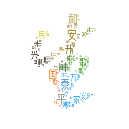

[](https://github.com/amueller/word_cloud/blob/master/LICENSE)

# handwriting_cn_wc
基于中国书法艺术字型的云词小应用

## Overview



## Quickstart
1. 准备书法字图片, 256x256, 白底黑字  
替换 /mask/shape_jia.png|shape_cn.jpeg 遮罩图片
2. 准备配色样本图片, 256x256, 白底     
替换 /mask/color_jia.jpeg|color_cn.jpeg 调色板图片 
3. 安装项目依赖
```bash
pip install -r requirement.txt
```
4. 运行项目脚本
```python
# python3x
python handw_cn.py # 生成汉字云词
python handw_jia.py # 生成图标云词
```
5. 查看输出云词图片文件目录：/out

## Frequently asked questions
**如何修改云词中汉字内容？**  
编辑 /conf/char_cn.json 按照json数组格式添加每一个汉字

**如何修改云词中字体效果？**  
1. 准备好字体文件test_diy.ttf|otf，添加到/font目录下
2. 修改脚本文件，更换gen_words中最后一个参数值 
```python
# handw_cn.py 
gen_words('char_cn.json',
              'shape_cn.jpeg',
              'color_cn.jpeg',
              'test_diy.ttf')

# handw_jia.py 
gen_words('char_icons.json', 
            'shape_jia.png', 
            'color_jia.jpeg', 
            'test_diy.ttf')
```  
### Future 
做一张家庭，班级，朋友，团队的笑脸书法云词^_^！


### Special thanks
- [python123](https://python123.io/tutorials/word_cloud)
- [word_cloud](https://github.com/amueller/word_cloud)

## Additional Resources
- [Nerd Fonts](https://www.nerdfonts.com/)
